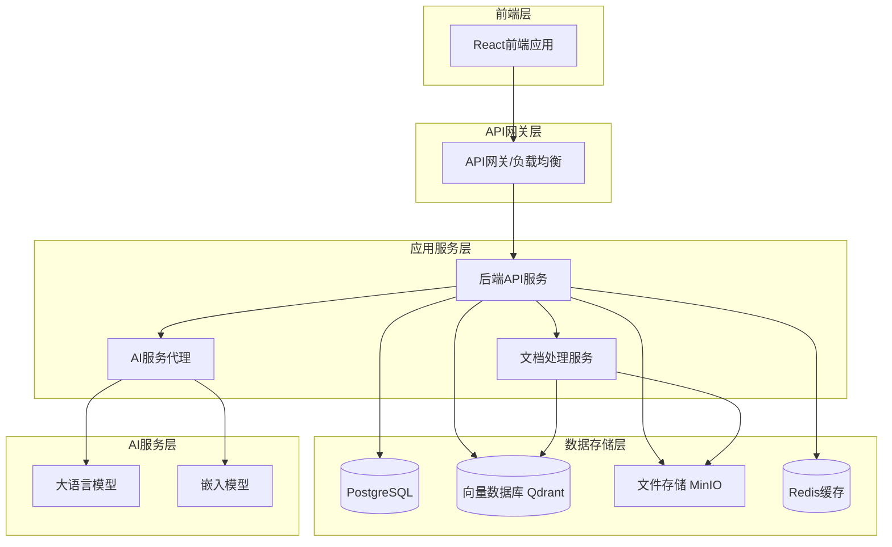

# 设计文档

## 概述

AI知识库应用采用微服务架构，包含后端API服务、前端Web应用、向量数据库、文件存储和AI服务集成。系统基于RAG（检索增强生成）架构，通过向量搜索和大语言模型结合，为用户提供智能的知识问答服务。

## 架构

### 系统架构图



### 技术栈选择

**后端服务**
- 框架：FastAPI (Python) - 高性能异步API框架
- 数据库：PostgreSQL - 关系型数据存储
- 向量数据库：Qdrant - 高性能向量搜索
- 缓存：Redis - 会话和查询缓存
- 文件存储：MinIO - S3兼容的对象存储
- 消息队列：Celery + Redis - 异步任务处理

**前端应用**
- 框架：React + TypeScript
- 状态管理：Zustand
- UI组件：Ant Design
- HTTP客户端：Axios
- 构建工具：Vite

**AI服务集成**
- 嵌入模型：sentence-transformers (本地) / OpenAI Embeddings (API)
- 大语言模型：Ollama (本地) / OpenAI GPT / Anthropic Claude (API)
- 文档解析：PyPDF2, python-docx, markdown

**部署和运维**
- 容器化：Docker + Docker Compose
- 反向代理：Nginx
- 监控：Prometheus + Grafana
- 日志：ELK Stack

## 组件和接口

### 后端API服务

#### 核心模块

1. **认证授权模块** (`auth/`)
   - JWT令牌管理
   - 用户认证和授权
   - 权限控制中间件

2. **文档管理模块** (`documents/`)
   - 文档上传和存储
   - 文档元数据管理
   - 文档删除和更新

3. **文档处理模块** (`processing/`)
   - 文件解析和内容提取
   - 文本预处理和分块
   - 向量化和索引

4. **对话查询模块** (`chat/`)
   - 问题向量化
   - 语义搜索
   - RAG查询处理
   - 对话历史管理

5. **AI服务模块** (`ai/`)
   - AI服务抽象接口
   - 多种AI服务适配器
   - 服务健康检查和故障转移

#### API接口设计

**文档管理API**
```
POST /api/v1/documents/upload - 上传文档
GET /api/v1/documents - 获取文档列表
GET /api/v1/documents/{id} - 获取文档详情
DELETE /api/v1/documents/{id} - 删除文档
GET /api/v1/documents/search - 搜索文档
```

**对话查询API**
```
POST /api/v1/chat/conversations - 创建对话会话
GET /api/v1/chat/conversations - 获取对话列表
POST /api/v1/chat/conversations/{id}/messages - 发送消息
GET /api/v1/chat/conversations/{id}/messages - 获取对话历史
```

**系统管理API**
```
GET /api/v1/health - 健康检查
GET /api/v1/status - 系统状态
POST /api/v1/admin/ai-config - 配置AI服务
```

### 前端应用架构

#### 页面结构
```
src/
├── components/          # 通用组件
│   ├── Layout/         # 布局组件
│   ├── DocumentList/   # 文档列表
│   ├── ChatInterface/  # 对话界面
│   └── FileUpload/     # 文件上传
├── pages/              # 页面组件
│   ├── Dashboard/      # 仪表板
│   ├── Documents/      # 文档管理
│   ├── Chat/          # 对话页面
│   └── Settings/      # 设置页面
├── services/          # API服务
├── stores/           # 状态管理
├── utils/            # 工具函数
└── types/            # TypeScript类型定义
```

#### 状态管理
- 用户状态：认证信息、用户配置
- 文档状态：文档列表、上传进度、搜索结果
- 对话状态：对话列表、消息历史、输入状态
- 系统状态：加载状态、错误信息、通知

## 数据模型

### 数据库表设计

**用户表 (users)**
```sql
CREATE TABLE users (
    id UUID PRIMARY KEY DEFAULT gen_random_uuid(),
    username VARCHAR(50) UNIQUE NOT NULL,
    email VARCHAR(100) UNIQUE NOT NULL,
    password_hash VARCHAR(255) NOT NULL,
    created_at TIMESTAMP DEFAULT CURRENT_TIMESTAMP,
    updated_at TIMESTAMP DEFAULT CURRENT_TIMESTAMP
);
```

**文档表 (documents)**
```sql
CREATE TABLE documents (
    id UUID PRIMARY KEY DEFAULT gen_random_uuid(),
    user_id UUID REFERENCES users(id),
    filename VARCHAR(255) NOT NULL,
    original_name VARCHAR(255) NOT NULL,
    file_size BIGINT NOT NULL,
    mime_type VARCHAR(100) NOT NULL,
    file_path VARCHAR(500) NOT NULL,
    status VARCHAR(20) DEFAULT 'processing',
    created_at TIMESTAMP DEFAULT CURRENT_TIMESTAMP,
    updated_at TIMESTAMP DEFAULT CURRENT_TIMESTAMP
);
```

**文档块表 (document_chunks)**
```sql
CREATE TABLE document_chunks (
    id UUID PRIMARY KEY DEFAULT gen_random_uuid(),
    document_id UUID REFERENCES documents(id),
    chunk_index INTEGER NOT NULL,
    content TEXT NOT NULL,
    metadata JSONB,
    vector_id VARCHAR(100),
    created_at TIMESTAMP DEFAULT CURRENT_TIMESTAMP
);
```

**对话表 (conversations)**
```sql
CREATE TABLE conversations (
    id UUID PRIMARY KEY DEFAULT gen_random_uuid(),
    user_id UUID REFERENCES users(id),
    title VARCHAR(255),
    created_at TIMESTAMP DEFAULT CURRENT_TIMESTAMP,
    updated_at TIMESTAMP DEFAULT CURRENT_TIMESTAMP
);
```

**消息表 (messages)**
```sql
CREATE TABLE messages (
    id UUID PRIMARY KEY DEFAULT gen_random_uuid(),
    conversation_id UUID REFERENCES conversations(id),
    role VARCHAR(20) NOT NULL, -- 'user' or 'assistant'
    content TEXT NOT NULL,
    metadata JSONB,
    created_at TIMESTAMP DEFAULT CURRENT_TIMESTAMP
);
```

### 向量数据库结构

**Qdrant集合配置**
```python
{
    "collection_name": "document_chunks",
    "vectors": {
        "size": 1536,  # 向量维度（根据嵌入模型调整）
        "distance": "Cosine"
    },
    "payload_schema": {
        "document_id": "keyword",
        "chunk_index": "integer", 
        "content": "text",
        "metadata": "object"
    }
}
```

## 错误处理

### 错误分类和处理策略

1. **客户端错误 (4xx)**
   - 400 Bad Request: 请求参数错误
   - 401 Unauthorized: 未认证
   - 403 Forbidden: 权限不足
   - 404 Not Found: 资源不存在
   - 413 Payload Too Large: 文件过大

2. **服务器错误 (5xx)**
   - 500 Internal Server Error: 服务器内部错误
   - 502 Bad Gateway: AI服务不可用
   - 503 Service Unavailable: 服务暂时不可用

### 错误响应格式
```json
{
    "error": {
        "code": "DOCUMENT_PROCESSING_FAILED",
        "message": "文档处理失败",
        "details": "不支持的文件格式",
        "timestamp": "2024-01-01T00:00:00Z"
    }
}
```

### 重试和降级策略

1. **AI服务调用**
   - 指数退避重试（最多3次）
   - 服务降级：API服务失败时切换到本地模型
   - 熔断器模式：连续失败时暂时停止调用

2. **向量搜索**
   - 搜索超时处理
   - 降级到关键词搜索
   - 缓存热门查询结果

3. **文档处理**
   - 异步处理队列
   - 失败重试机制
   - 处理状态跟踪

## 测试策略

### 测试层次

1. **单元测试**
   - 业务逻辑函数测试
   - 数据模型验证测试
   - AI服务适配器测试
   - 覆盖率目标：>80%

2. **集成测试**
   - API接口测试
   - 数据库操作测试
   - 外部服务集成测试
   - 文档处理流程测试

3. **端到端测试**
   - 用户完整操作流程
   - 文档上传到查询的完整链路
   - 多用户并发测试

### 测试工具和框架

**后端测试**
- pytest: 单元测试和集成测试
- pytest-asyncio: 异步测试支持
- httpx: HTTP客户端测试
- factory_boy: 测试数据生成

**前端测试**
- Jest: 单元测试框架
- React Testing Library: 组件测试
- Cypress: 端到端测试
- MSW: API模拟

### 性能测试

1. **负载测试**
   - 并发用户数：100-1000
   - 文档上传性能
   - 查询响应时间
   - 系统资源使用率

2. **压力测试**
   - 极限并发测试
   - 大文件处理测试
   - 长时间运行稳定性测试

### 测试数据管理

1. **测试数据库**
   - 独立的测试数据库实例
   - 测试数据自动清理
   - 测试夹具管理

2. **模拟服务**
   - AI服务模拟器
   - 文件存储模拟
   - 向量数据库模拟