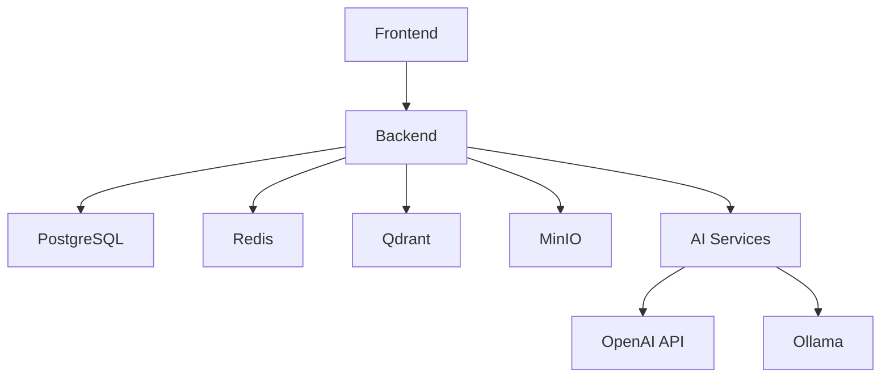

# Docker Deployment Guide

This guide provides comprehensive instructions for deploying the AI Knowledge Base application using Docker containers.

## Table of Contents

- [Prerequisites](#prerequisites)
- [Quick Start](#quick-start)
- [Environment Configuration](#environment-configuration)
- [Deployment Options](#deployment-options)
- [Service Architecture](#service-architecture)
- [Data Persistence](#data-persistence)
- [Backup and Restore](#backup-and-restore)
- [Monitoring and Logs](#monitoring-and-logs)
- [Troubleshooting](#troubleshooting)
- [Production Considerations](#production-considerations)

## Prerequisites

### System Requirements

- **Docker**: Version 20.10 or higher
- **Docker Compose**: Version 2.0 or higher
- **System Memory**: Minimum 4GB RAM (8GB recommended for production)
- **Disk Space**: Minimum 10GB free space
- **Network**: Internet connection for pulling images and AI services

### Installation

#### Docker Installation

**Ubuntu/Debian:**
```bash
curl -fsSL https://get.docker.com -o get-docker.sh
sudo sh get-docker.sh
sudo usermod -aG docker $USER
```

**macOS:**
```bash
# Install Docker Desktop from https://docker.com/products/docker-desktop
# Or using Homebrew:
brew install --cask docker
```

**Windows:**
Download and install Docker Desktop from https://docker.com/products/docker-desktop

#### Docker Compose Installation

Docker Compose is included with Docker Desktop. For Linux:
```bash
sudo curl -L "https://github.com/docker/compose/releases/latest/download/docker-compose-$(uname -s)-$(uname -m)" -o /usr/local/bin/docker-compose
sudo chmod +x /usr/local/bin/docker-compose
```

## Quick Start

### 1. Clone and Setup

```bash
# Clone the repository
git clone <repository-url>
cd ai-knowledge-base

# Copy environment configuration
cp .env.example .env

# Edit configuration (see Environment Configuration section)
nano .env
```

### 2. Deploy Development Environment

```bash
# Using the deployment script (recommended)
./scripts/deploy.sh

# Or manually with docker-compose
docker-compose up -d
```

### 3. Access the Application

- **Frontend**: http://localhost:3000
- **Backend API**: http://localhost:8000
- **API Documentation**: http://localhost:8000/docs
- **MinIO Console**: http://localhost:9001
- **Qdrant Dashboard**: http://localhost:6333/dashboard

### 4. Initial Setup

1. Create your first user account through the frontend
2. Upload some documents to test the system
3. Try asking questions about your documents

## Environment Configuration

### Environment Variables

The application uses environment variables for configuration. Copy `.env.example` to `.env` and customize:

#### Required Variables

```bash
# Database
POSTGRES_PASSWORD=your_secure_password_here

# Redis
REDIS_PASSWORD=your_redis_password_here

# MinIO
MINIO_ROOT_PASSWORD=your_minio_password_here

# JWT Security
SECRET_KEY=your_jwt_secret_key_minimum_32_characters

# AI Services (at least one required)
OPENAI_API_KEY=your_openai_api_key_here
```

#### Optional Variables

```bash
# Application Settings
DEBUG=false
LOG_LEVEL=INFO

# Port Configuration
BACKEND_PORT=8000
FRONTEND_PORT=3000

# AI Service Configuration
OLLAMA_BASE_URL=http://ollama:11434
```

### Security Considerations

1. **Change Default Passwords**: Always change default passwords in production
2. **Strong JWT Secret**: Use a cryptographically secure random string (32+ characters)
3. **API Keys**: Store AI service API keys securely
4. **Network Security**: Use firewalls and VPNs in production

## Deployment Options

### Development Deployment

For local development with hot reloading:

```bash
# Start development environment
./scripts/deploy.sh --env development

# Or with docker-compose
docker-compose -f docker-compose.yml up -d
```

Features:
- Hot reloading for backend and frontend
- Debug logging enabled
- All ports exposed for direct access
- Development-friendly configurations

### Production Deployment

For production environments:

```bash
# Create production environment file
cp .env.example .env.prod
# Edit .env.prod with production values

# Deploy production environment
./scripts/deploy.sh --env production --env-file .env.prod

# Or with docker-compose
docker-compose -f docker-compose.prod.yml --env-file .env.prod up -d
```

Features:
- Optimized for performance and security
- Nginx reverse proxy with SSL support
- Centralized logging
- Health checks and restart policies
- Resource limits and security hardening

### Development Services Only

For development when running backend/frontend locally:

```bash
# Start only databases and storage services
docker-compose -f docker-compose.dev.yml up -d
```

This starts:
- PostgreSQL database
- Redis cache
- Qdrant vector database
- MinIO object storage

## Service Architecture

### Core Services

| Service | Purpose | Port | Health Check |
|---------|---------|------|--------------|
| **postgres** | Primary database | 5432 | `pg_isready` |
| **redis** | Cache and sessions | 6379 | `redis-cli ping` |
| **qdrant** | Vector database | 6333/6334 | HTTP health endpoint |
| **minio** | Object storage | 9000/9001 | MinIO health endpoint |
| **backend** | FastAPI application | 8000 | `/health` endpoint |
| **frontend** | React application | 80 | HTTP response check |

### Optional Services

| Service | Purpose | Port | Profile |
|---------|---------|------|---------|
| **ollama** | Local AI models | 11434 | `ollama` |
| **nginx** | Reverse proxy | 80/443 | Production only |

### Service Dependencies



## Data Persistence

### Volume Management

The application uses Docker volumes for data persistence:

```bash
# List application volumes
docker volume ls | grep ai_kb

# Inspect volume details
docker volume inspect ai_kb_postgres_data

# Backup volume data
docker run --rm -v ai_kb_postgres_data:/data -v $(pwd):/backup alpine tar czf /backup/postgres_backup.tar.gz -C /data .
```

### Volume Structure

| Volume | Purpose | Backup Priority |
|--------|---------|-----------------|
| `postgres_data` | Database files | **Critical** |
| `qdrant_data` | Vector embeddings | **Critical** |
| `minio_data` | Uploaded files | **Critical** |
| `redis_data` | Cache data | Low |
| `backend_logs` | Application logs | Medium |

### Data Migration

To migrate data between environments:

```bash
# Export data from source
./scripts/backup.sh --env development

# Import data to target
./scripts/backup.sh --env production --restore backups/postgres_20240101_120000.sql.gz
```

## Backup and Restore

### Automated Backups

Use the provided backup script:

```bash
# Full backup
./scripts/backup.sh

# Database only
./scripts/backup.sh --db-only

# Files only
./scripts/backup.sh --files-only

# Production environment
./scripts/backup.sh --env production
```

### Backup Schedule

Set up automated backups with cron:

```bash
# Edit crontab
crontab -e

# Add daily backup at 2 AM
0 2 * * * /path/to/ai-knowledge-base/scripts/backup.sh --env production

# Add weekly cleanup
0 3 * * 0 /path/to/ai-knowledge-base/scripts/backup.sh --cleanup --keep 30
```

### Restore Procedures

```bash
# List available backups
./scripts/backup.sh --list

# Restore specific backup
./scripts/backup.sh --restore backups/postgres_20240101_120000.sql.gz

# Full system restore
./scripts/backup.sh --restore backups/full_backup_20240101.tar.gz
```

## Monitoring and Logs

### Log Management

```bash
# View all service logs
docker-compose logs -f

# View specific service logs
docker-compose logs -f backend

# View logs with timestamps
docker-compose logs -f -t

# Follow logs from last 100 lines
docker-compose logs -f --tail=100
```

### Health Monitoring

```bash
# Check service health
docker-compose ps

# Detailed health status
docker inspect --format='{{.State.Health.Status}}' ai_kb_backend

# Service resource usage
docker stats
```

### Log Rotation

Configure log rotation to prevent disk space issues:

```bash
# Create logrotate configuration
sudo tee /etc/logrotate.d/docker-ai-kb << EOF
/var/lib/docker/containers/*/*-json.log {
    daily
    rotate 7
    compress
    delaycompress
    missingok
    notifempty
    create 0644 root root
    postrotate
        docker kill --signal=USR1 \$(docker ps -q) 2>/dev/null || true
    endscript
}
EOF
```

## Troubleshooting

### Common Issues

#### 1. Port Conflicts

```bash
# Check port usage
sudo netstat -tulpn | grep :8000

# Change ports in .env file
BACKEND_PORT=8001
FRONTEND_PORT=3001
```

#### 2. Memory Issues

```bash
# Check system memory
free -h

# Monitor container memory usage
docker stats --format "table {{.Container}}\t{{.CPUPerc}}\t{{.MemUsage}}"

# Increase Docker memory limit (Docker Desktop)
# Settings > Resources > Memory > Increase limit
```

#### 3. Database Connection Issues

```bash
# Check PostgreSQL logs
docker-compose logs postgres

# Test database connection
docker-compose exec postgres psql -U postgres -d ai_knowledge_base -c "SELECT 1;"

# Reset database
docker-compose down
docker volume rm ai_kb_postgres_data
docker-compose up -d
```

#### 4. AI Service Issues

```bash
# Test OpenAI API key
curl -H "Authorization: Bearer $OPENAI_API_KEY" https://api.openai.com/v1/models

# Check Ollama service
docker-compose exec ollama ollama list

# Pull required models
docker-compose exec ollama ollama pull llama2
```

### Debug Mode

Enable debug mode for detailed logging:

```bash
# Set in .env file
DEBUG=true
LOG_LEVEL=DEBUG

# Restart services
docker-compose restart backend
```

### Performance Tuning

#### Database Optimization

```bash
# Increase PostgreSQL memory settings
docker-compose exec postgres psql -U postgres -c "
ALTER SYSTEM SET shared_buffers = '256MB';
ALTER SYSTEM SET effective_cache_size = '1GB';
SELECT pg_reload_conf();
"
```

#### Vector Database Optimization

```bash
# Optimize Qdrant for your use case
# Edit docker-compose.yml to add:
environment:
  QDRANT__SERVICE__MAX_REQUEST_SIZE_MB: 32
  QDRANT__STORAGE__PERFORMANCE__MAX_SEARCH_THREADS: 4
```

## Production Considerations

### Security Hardening

1. **Use HTTPS**: Configure SSL certificates in nginx
2. **Network Isolation**: Use Docker networks and firewalls
3. **Secret Management**: Use Docker secrets or external secret managers
4. **Regular Updates**: Keep images and dependencies updated
5. **Access Control**: Implement proper authentication and authorization

### SSL Configuration

```bash
# Generate self-signed certificate (development)
mkdir -p nginx/ssl
openssl req -x509 -nodes -days 365 -newkey rsa:2048 \
    -keyout nginx/ssl/key.pem \
    -out nginx/ssl/cert.pem

# For production, use Let's Encrypt or commercial certificates
```

### Resource Limits

Add resource limits to docker-compose.prod.yml:

```yaml
services:
  backend:
    deploy:
      resources:
        limits:
          cpus: '2.0'
          memory: 2G
        reservations:
          cpus: '0.5'
          memory: 512M
```

### High Availability

For production deployments:

1. **Load Balancing**: Use multiple backend instances
2. **Database Clustering**: PostgreSQL streaming replication
3. **Shared Storage**: Network-attached storage for files
4. **Monitoring**: Prometheus + Grafana setup
5. **Alerting**: Configure alerts for service failures

### Scaling

```bash
# Scale backend service
docker-compose up -d --scale backend=3

# Use Docker Swarm for multi-node deployment
docker swarm init
docker stack deploy -c docker-compose.prod.yml ai-kb
```

## Maintenance

### Regular Tasks

1. **Update Images**: `docker-compose pull && docker-compose up -d`
2. **Clean Unused Resources**: `docker system prune -f`
3. **Monitor Disk Usage**: `df -h` and `docker system df`
4. **Review Logs**: Check for errors and warnings
5. **Test Backups**: Regularly test backup restoration

### Update Procedure

```bash
# 1. Backup current state
./scripts/backup.sh

# 2. Pull latest images
docker-compose pull

# 3. Restart with new images
docker-compose up -d

# 4. Verify services
docker-compose ps
./scripts/deploy.sh --logs
```

This completes the comprehensive Docker deployment guide for the AI Knowledge Base application.